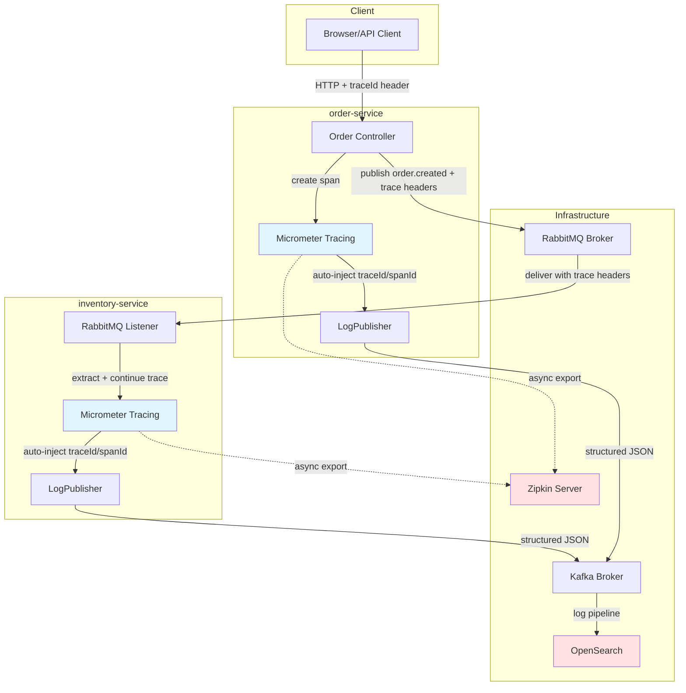

# Distributed Tracing Implementation Plan

**Document Version:** 1.0  
**Created:** 2025-11-16  
**Target:** All microservices (product, inventory, order, review, logging)  
**Objective:** Implement end-to-end distributed tracing with automatic trace context propagation across HTTP, RabbitMQ, and Kafka, integrated with existing structured logging infrastructure.

---

## Table of Contents

1. [Executive Summary](#executive-summary)
2. [Business Requirements](#business-requirements)
3. [Technical Architecture](#technical-architecture)
4. [Technology Stack](#technology-stack)
5. [Implementation Phases](#implementation-phases)
6. [Data Model & Trace Schema](#data-model--trace-schema)
7. [Integration Points](#integration-points)
8. [Testing Strategy](#testing-strategy)
9. [Deployment Plan](#deployment-plan)
10. [Monitoring & Observability](#monitoring--observability)
11. [Risks & Mitigation](#risks--mitigation)
12. [Success Metrics](#success-metrics)

---

## Executive Summary

### Purpose
Implement distributed tracing to enable end-to-end request tracking across all microservices, providing visibility into request flows, latency bottlenecks, and failure points. Integrate trace context (traceId, spanId) with existing Kafka-based structured logging to create a unified observability platform.

### Approach
- **Micrometer Tracing**: Use Spring Boot 3.x native tracing support with Micrometer Tracing Bridge
- **Brave/Zipkin**: Leverage Brave tracer implementation for trace generation and propagation
- **Auto-instrumentation**: Automatic trace context propagation across HTTP, RabbitMQ, and manual Kafka integration
- **Kafka Logging Integration**: Enhance existing `logging-client` to automatically include trace context
- **Visualization**: Export traces to Zipkin for visualization and analysis
- **OpenSearch Integration**: Leverage existing OpenSearch setup for trace storage and correlation with logs

### Success Criteria
- ✅ Automatic trace ID generation for all incoming HTTP requests
- ✅ Trace context propagation across service boundaries (HTTP + RabbitMQ)
- ✅ All structured logs include traceId and spanId when available
- ✅ Trace visualization available in Zipkin UI
- ✅ End-to-end trace for order creation flow (order → inventory → order confirmation)
- ✅ Query logs by traceId in OpenSearch
- ✅ <5ms overhead per traced operation
- ✅ Zero breaking changes to existing APIs

---

## Business Requirements

### Functional Requirements

**FR-1: Automatic Trace Generation**
- All incoming HTTP requests must generate a unique trace ID
- If a trace ID is provided in request headers (e.g., from external client), it must be preserved
- Trace IDs must follow W3C Trace Context or Zipkin B3 format

**FR-2: Cross-Service Trace Propagation**
- Trace context must propagate automatically across:
  - HTTP REST calls between services
  - RabbitMQ message publishing and consumption
  - Kafka message publishing (via logging-client)
- Each service interaction creates a new span linked to the parent trace

**FR-3: Structured Logging Integration**
- All logs published via `logging-client` must include:
  - `traceId`: Current trace identifier
  - `spanId`: Current span identifier
  - Automatic extraction from Spring context (no manual coding required)

**FR-4: Trace Visualization**
- Traces must be exportable to Zipkin for UI visualization
- Trace data must show:
  - Service call hierarchy
  - Span durations
  - Tags (service name, HTTP method, status code, etc.)
  - Annotations for key events

**FR-5: OpenSearch Integration**
- Traces should be queryable in OpenSearch alongside logs
- Enable correlation between logs and traces via shared traceId
- Support filtering logs by traceId to see complete request flow

### Non-Functional Requirements

**NFR-1: Performance**
- Tracing overhead must be <5ms per request
- Sampling strategy to reduce volume in production (configurable, e.g., 10% sampling)

**NFR-2: Reliability**
- Tracing failures must not impact business logic
- Asynchronous trace export to avoid blocking requests

**NFR-3: Backward Compatibility**
- No breaking changes to existing service APIs
- Existing `logging-client` consumers continue to work without modification
- Services without tracing enabled should not break

**NFR-4: Configuration**
- Tracing should be configurable per service (enable/disable, sampling rate)
- Zipkin endpoint configurable via environment variables

---

## Technical Architecture

### High-Level Architecture Diagram



### Component Responsibilities

**Micrometer Tracing**
- Generate trace IDs and span IDs
- Manage trace context lifecycle
- Auto-instrument HTTP clients/servers
- Propagate context via thread-local storage

**Brave Tracer**
- Concrete implementation of tracing logic
- B3 propagation format for headers
- Span creation and management
- Integration with Zipkin reporter

**Spring Cloud Sleuth (deprecated) → Spring Boot 3.x Native**
- Spring Boot 3.x has built-in Micrometer Tracing support
- No need for separate Spring Cloud Sleuth dependency
- Uses `spring-boot-starter-actuator` + micrometer-tracing libraries

**Zipkin Reporter**
- Asynchronous trace export to Zipkin server
- Batching and compression
- Configurable flush intervals

**logging-client Enhancement**
- Auto-detect trace context from Micrometer
- Inject traceId and spanId into LogMessage
- No API changes required for consumers

---

## Technology Stack

### Core Dependencies

All services will add the following dependencies:

```xml
<!-- Micrometer Tracing Bridge for Brave -->
<dependency>
    <groupId>io.micrometer</groupId>
    <artifactId>micrometer-tracing-bridge-brave</artifactId>
</dependency>

<!-- Zipkin Reporter for exporting traces -->
<dependency>
    <groupId>io.zipkin.reporter2</groupId>
    <artifactId>zipkin-reporter-brave</artifactId>
</dependency>

<!-- Spring Boot Actuator (if not already present) -->
<dependency>
    <groupId>org.springframework.boot</groupId>
    <artifactId>spring-boot-starter-actuator</artifactId>
</dependency>

<!-- RabbitMQ tracing propagation -->
<dependency>
    <groupId>io.micrometer</groupId>
    <artifactId>micrometer-tracing-integration-rabbit</artifactId>
    <version>1.3.0</version> <!-- match micrometer-tracing version -->
</dependency>
```

### Infrastructure Components

**Zipkin Server**
- Docker image: `openzipkin/zipkin:latest`
- Default port: 9411
- Storage: In-memory (dev), OpenSearch (production)

**OpenSearch**
- Already running in docker-compose (port 9200)
- Will store both logs and traces
- Kafka Connect pipeline for log ingestion (already configured)

### Version Compatibility

- Spring Boot: 3.5.7 (already in use)
- Java: 21 (already in use)
- Micrometer Tracing: 1.3.x (compatible with Spring Boot 3.5.x)
- Brave: 6.0.x (compatible with Micrometer Tracing 1.3.x)
- Zipkin Reporter: 3.x

---

## Implementation Phases

### Phase 1: Infrastructure Setup (Week 1)

**Goal:** Set up Zipkin server and update docker-compose

**Tasks:**

1.1. **Add Zipkin to docker-compose.yml**
```yaml
zipkin-service:
  image: openzipkin/zipkin:latest
  container_name: zipkin-service
  environment:
    - STORAGE_TYPE=mem
    # Future: STORAGE_TYPE=elasticsearch, ES_HOSTS=http://opensearch:9200
  ports:
    - "9411:9411"
  healthcheck:
    test: ["CMD", "wget", "-qO-", "http://localhost:9411/health"]
    interval: 5s
    timeout: 3s
    retries: 5
```

1.2. **Test Zipkin UI**
- Start docker-compose
- Access http://localhost:9411
- Verify Zipkin UI loads

1.3. **Document Zipkin endpoints**
- Update `docs/service-topology.md` with Zipkin information
- Document trace query examples

**Acceptance Criteria:**
- ✅ Zipkin container starts successfully
- ✅ Zipkin UI accessible at http://localhost:9411
- ✅ Documentation updated

**Effort:** 2 hours

---

### Phase 2: logging-client Enhancement (Week 1)

**Goal:** Auto-inject trace context into structured logs

**Tasks:**

2.1. **Update logging-client dependencies**
- Add Micrometer Tracing dependency to `services/logging-client/pom.xml`
- Add optional dependency (won't break services without tracing)

2.2. **Create TraceContextExtractor utility**
```java
package nik.kalomiris.logging_client;

import io.micrometer.tracing.Tracer;
import org.springframework.stereotype.Component;

@Component
public class TraceContextExtractor {
    private final Tracer tracer;
    
    public TraceContextExtractor(Tracer tracer) {
        this.tracer = tracer;
    }
    
    public String getTraceId() {
        if (tracer == null || tracer.currentSpan() == null) {
            return null;
        }
        return tracer.currentSpan().context().traceId();
    }
    
    public String getSpanId() {
        if (tracer == null || tracer.currentSpan() == null) {
            return null;
        }
        return tracer.currentSpan().context().spanId();
    }
}
```

2.3. **Update LogPublisher to auto-inject trace context**
```java
@Service
public class LogPublisher {
    private final KafkaTemplate<String, String> kafkaTemplate;
    private final ObjectMapper objectMapper;
    private final TraceContextExtractor traceExtractor; // NEW
    
    public LogPublisher(
            KafkaTemplate<String, String> kafkaTemplate,
            ObjectMapper objectMapper,
            @Autowired(required = false) TraceContextExtractor traceExtractor) {
        this.kafkaTemplate = kafkaTemplate;
        this.objectMapper = objectMapper;
        this.traceExtractor = traceExtractor;
    }
    
    public void publish(LogMessage logMessage) {
        // Auto-inject trace context if not already set
        if (traceExtractor != null) {
            if (logMessage.getTraceId() == null) {
                logMessage.setTraceId(traceExtractor.getTraceId());
            }
            if (logMessage.getSpanId() == null) {
                logMessage.setSpanId(traceExtractor.getSpanId());
            }
        }
        
        // Rest of publishing logic...
    }
}
```

2.4. **Update STRUCTURED_LOGGING.md**
- Document automatic trace context injection
- Show examples with and without manual trace ID setting

2.5. **Write unit tests**
- Test with tracer present
- Test with tracer absent (backward compatibility)
- Test manual override of trace context

**Acceptance Criteria:**
- ✅ TraceContextExtractor extracts current trace context
- ✅ LogPublisher auto-injects trace IDs when available
- ✅ Backward compatible with services not using tracing
- ✅ Unit tests pass
- ✅ Documentation updated

**Effort:** 4 hours

---

### Phase 3: Core Service Tracing (Week 1-2)

**Goal:** Enable tracing in product-service and order-service

**Tasks:**

3.1. **Update parent pom.xml**
- Add Micrometer Tracing dependencies to dependency management section
- Ensures consistent versions across all services

3.2. **Add tracing dependencies to product-service**
- Update `services/product-service/pom.xml`
- Add micrometer-tracing-bridge-brave
- Add zipkin-reporter-brave
- Add spring-boot-starter-actuator (if missing)

3.3. **Configure tracing in product-service**
- Update `src/main/resources/application.properties`:
```properties
# Tracing configuration
management.tracing.sampling.probability=1.0
management.zipkin.tracing.endpoint=http://zipkin-service:9411/api/v2/spans
spring.application.name=product-service

# Propagation format (B3)
management.tracing.propagation.type=B3
```

3.4. **Add tracing dependencies to order-service**
- Same as 3.2 for order-service

3.5. **Configure tracing in order-service**
- Same as 3.3 for order-service
- Update docker-compose environment to include Zipkin endpoint

3.6. **Test HTTP tracing**
```bash
# Create a product
curl -X POST http://localhost:8080/api/products \
  -H "Content-Type: application/json" \
  -d '{"name": "Test Product", "price": 99.99}'

# Check Zipkin UI for trace
# Verify traceId appears in logs
```

3.7. **Verify log integration**
- Check Kafka logs include traceId and spanId
- Verify OpenSearch can filter by traceId

**Acceptance Criteria:**
- ✅ HTTP requests generate trace IDs
- ✅ Traces visible in Zipkin UI
- ✅ Logs include traceId and spanId
- ✅ No performance degradation (<5ms overhead)

**Effort:** 6 hours

---

### Phase 4: RabbitMQ Trace Propagation (Week 2)

**Goal:** Propagate trace context across RabbitMQ messages

**Tasks:**

4.1. **Add RabbitMQ tracing integration**
- Add `micrometer-tracing-integration-rabbit` to inventory-service and order-service

4.2. **Configure RabbitMQ with tracing support**
```java
@Configuration
public class RabbitMQTracingConfig {
    
    @Bean
    public RabbitListenerConfigurer rabbitListenerConfigurer(
            ObservationRegistry observationRegistry) {
        return registrar -> {
            registrar.setObservationEnabled(true);
            registrar.setObservationRegistry(observationRegistry);
        };
    }
}
```

4.3. **Update RabbitTemplate for trace propagation**
```java
@Configuration
public class RabbitMQConfig {
    
    @Bean
    public RabbitTemplate rabbitTemplate(
            ConnectionFactory connectionFactory,
            ObservationRegistry observationRegistry) {
        RabbitTemplate template = new RabbitTemplate(connectionFactory);
        template.setObservationEnabled(true);
        template.setObservationRegistry(observationRegistry);
        return template;
    }
}
```

4.4. **Test order creation flow with tracing**
```bash
# Create order (should trigger inventory check)
curl -X POST http://localhost:8081/api/orders \
  -H "Content-Type: application/json" \
  -d '{
    "productId": 1,
    "quantity": 2,
    "userId": 123
  }'

# Check Zipkin for multi-service trace:
# 1. order-service HTTP span
# 2. order-service publish span
# 3. inventory-service consume span
# 4. inventory-service publish span (reservation response)
# 5. order-service consume span (confirmation)
```

4.5. **Verify trace continuity**
- Single trace ID across all services
- Parent-child span relationships correct
- RabbitMQ message headers include trace context

**Acceptance Criteria:**
- ✅ Trace context propagates through RabbitMQ
- ✅ Single trace spans multiple services
- ✅ Span hierarchy shows message flow
- ✅ Logs from all services share traceId

**Effort:** 8 hours

---

### Phase 5: Remaining Services (Week 2-3)

**Goal:** Enable tracing in inventory-service and review-service

**Tasks:**

5.1. **Add tracing to inventory-service**
- Add dependencies
- Configure application.properties
- Test product creation event handling

5.2. **Add tracing to review-service**
- Add dependencies
- Configure application.properties
- Test review submission

5.3. **Update logging-service**
- Add minimal tracing support (for consistency)
- logging-service mostly consumes logs, doesn't initiate traces

**Acceptance Criteria:**
- ✅ All services export traces
- ✅ All services include trace context in logs
- ✅ Consistent configuration across services

**Effort:** 4 hours

---

### Phase 6: OpenSearch Integration (Week 3)

**Goal:** Configure OpenSearch to store traces and enable trace-log correlation

**Tasks:**

6.1. **Configure Zipkin with OpenSearch storage**
- Update docker-compose.yml to use OpenSearch backend:
```yaml
zipkin-service:
  image: openzipkin/zipkin:latest
  container_name: zipkin-service
  environment:
    - STORAGE_TYPE=elasticsearch
    - ES_HOSTS=http://opensearch:9200
    - ES_INDEX=zipkin
  ports:
    - "9411:9411"
  depends_on:
    - opensearch
```

6.2. **Create OpenSearch index template for traces**
```json
{
  "index_patterns": ["zipkin*"],
  "template": {
    "settings": {
      "number_of_shards": 1,
      "number_of_replicas": 0
    },
    "mappings": {
      "properties": {
        "traceId": { "type": "keyword" },
        "spanId": { "type": "keyword" },
        "parentId": { "type": "keyword" },
        "name": { "type": "keyword" },
        "timestamp": { "type": "date" },
        "duration": { "type": "long" },
        "tags": { "type": "object" }
      }
    }
  }
}
```

6.3. **Create OpenSearch Dashboard for trace-log correlation**
- Query logs and traces by shared traceId
- Visualize trace duration alongside log volume
- Create saved searches for common trace patterns

6.4. **Document OpenSearch queries**
```json
// Find all logs for a specific trace
{
  "query": {
    "term": {
      "traceId": "abc123def456"
    }
  }
}

// Find traces with high duration
{
  "query": {
    "range": {
      "duration": {
        "gte": 1000000
      }
    }
  }
}
```

**Acceptance Criteria:**
- ✅ Zipkin stores traces in OpenSearch
- ✅ Traces queryable via OpenSearch API
- ✅ Dashboard shows trace-log correlation
- ✅ Documentation includes query examples

**Effort:** 6 hours

---

### Phase 7: Production Readiness (Week 3-4)

**Goal:** Configure sampling, error handling, and performance tuning

**Tasks:**

7.1. **Implement sampling strategy**
```properties
# Production configuration
management.tracing.sampling.probability=0.1  # 10% sampling

# High-value endpoints - always trace (custom config)
management.tracing.sampling.rate.order-creation=1.0
```

7.2. **Add custom span tags**
```java
@Service
public class OrderService {
    private final Tracer tracer;
    
    public Order createOrder(OrderRequest request) {
        Span span = tracer.currentSpan();
        if (span != null) {
            span.tag("order.product_id", request.getProductId().toString());
            span.tag("order.quantity", request.getQuantity().toString());
            span.tag("order.user_id", request.getUserId().toString());
        }
        // ... business logic
    }
}
```

7.3. **Add error tracking to spans**
```java
try {
    // business logic
} catch (Exception e) {
    Span span = tracer.currentSpan();
    if (span != null) {
        span.error(e);
        span.tag("error", "true");
    }
    throw e;
}
```

7.4. **Performance testing**
- Load test with tracing enabled vs disabled
- Measure overhead per request
- Tune async export settings

7.5. **Create runbook for trace analysis**
- How to find slow traces
- How to debug failed requests
- How to correlate logs and traces

**Acceptance Criteria:**
- ✅ Sampling reduces trace volume to acceptable levels
- ✅ Important business data tagged on spans
- ✅ Errors captured in traces
- ✅ Performance overhead <5ms
- ✅ Runbook documented

**Effort:** 8 hours

---

## Data Model & Trace Schema

### Trace Context Format

**B3 Propagation (HTTP Headers)**
```
X-B3-TraceId: 80f198ee56343ba864fe8b2a57d3eff7
X-B3-SpanId: e457b5a2e4d86bd1
X-B3-ParentSpanId: 05e3ac9a4f6e3b90
X-B3-Sampled: 1
```

**RabbitMQ Message Headers**
```java
{
  "X-B3-TraceId": "80f198ee56343ba864fe8b2a57d3eff7",
  "X-B3-SpanId": "e457b5a2e4d86bd1",
  "X-B3-ParentSpanId": "05e3ac9a4f6e3b90",
  "X-B3-Sampled": "1"
}
```

### Zipkin Span Schema

```json
{
  "traceId": "80f198ee56343ba864fe8b2a57d3eff7",
  "id": "e457b5a2e4d86bd1",
  "parentId": "05e3ac9a4f6e3b90",
  "name": "POST /api/orders",
  "timestamp": 1700000000000000,
  "duration": 150000,
  "kind": "SERVER",
  "localEndpoint": {
    "serviceName": "order-service",
    "ipv4": "172.18.0.5",
    "port": 8081
  },
  "tags": {
    "http.method": "POST",
    "http.path": "/api/orders",
    "http.status_code": "201",
    "order.product_id": "1",
    "order.quantity": "2"
  },
  "annotations": [
    {
      "timestamp": 1700000000050000,
      "value": "order.validated"
    }
  ]
}
```

### Enhanced LogMessage Schema

```json
{
  "timestamp": "2025-11-16T10:30:45.123Z",
  "level": "INFO",
  "service": "order-service",
  "message": "Order created successfully",
  "logger": "nik.kalomiris.order_service.OrderService",
  "thread": "http-nio-8081-exec-1",
  "traceId": "80f198ee56343ba864fe8b2a57d3eff7",
  "spanId": "e457b5a2e4d86bd1",
  "metadata": {
    "orderId": "12345",
    "productId": "1",
    "userId": "123"
  }
}
```

---

## Integration Points

### 1. HTTP Client/Server Integration

**Automatic (via Spring Boot auto-configuration):**
- RestTemplate instrumented automatically
- WebClient instrumented automatically
- Spring MVC controllers instrumented automatically
- Trace headers added to outbound requests
- Trace context extracted from inbound requests

**No code changes required** - just add dependencies and configuration.

### 2. RabbitMQ Integration

**Publisher Side (order-service):**
```java
// Automatic via ObservationRegistry
@Service
public class OrderEventPublisher {
    private final RabbitTemplate rabbitTemplate;
    
    public void publishOrderCreated(OrderCreatedEvent event) {
        // Trace context automatically added to message headers
        rabbitTemplate.convertAndSend(
            "order-exchange", 
            "order.created", 
            event
        );
    }
}
```

**Consumer Side (inventory-service):**
```java
// Automatic via RabbitListenerConfigurer
@RabbitListener(queues = "order.created.inventory.queue")
public void handleOrderCreated(OrderCreatedEvent event) {
    // Trace context automatically extracted from message headers
    // New span created as child of publisher span
    inventoryService.reserveStock(event.getProductId(), event.getQuantity());
}
```

### 3. Kafka Integration (Logging)

**Automatic via logging-client:**
```java
// In business logic
LogMessage log = new LogMessage.Builder()
    .message("Order created")
    .level("INFO")
    .service("order-service")
    .metadata(Map.of("orderId", orderId))
    // traceId and spanId automatically injected by LogPublisher
    .build();
    
logPublisher.publish(log);
```

### 4. Database Queries (Optional)

Spring Data JPA can be instrumented to create spans for database queries:

```properties
# application.properties
spring.jpa.properties.hibernate.session.events.log=true
management.metrics.enable.hibernate=true
```

Creates spans like:
- `SELECT product`
- `INSERT INTO orders`
- `UPDATE inventory`

---

## Testing Strategy

### Unit Tests

**Test 1: TraceContextExtractor with active trace**
```java
@Test
void shouldExtractTraceIdWhenTraceActive() {
    Tracer tracer = mock(Tracer.class);
    Span span = mock(Span.class);
    TraceContext context = mock(TraceContext.class);
    
    when(tracer.currentSpan()).thenReturn(span);
    when(span.context()).thenReturn(context);
    when(context.traceId()).thenReturn("abc123");
    
    TraceContextExtractor extractor = new TraceContextExtractor(tracer);
    assertEquals("abc123", extractor.getTraceId());
}
```

**Test 2: LogPublisher auto-injection**
```java
@Test
void shouldAutoInjectTraceContext() {
    // Setup
    TraceContextExtractor extractor = mock(TraceContextExtractor.class);
    when(extractor.getTraceId()).thenReturn("trace-123");
    when(extractor.getSpanId()).thenReturn("span-456");
    
    LogPublisher publisher = new LogPublisher(kafkaTemplate, objectMapper, extractor);
    
    LogMessage message = new LogMessage.Builder()
        .message("test")
        .build();
    
    // Execute
    publisher.publish(message);
    
    // Verify
    assertEquals("trace-123", message.getTraceId());
    assertEquals("span-456", message.getSpanId());
}
```

**Test 3: Backward compatibility (no tracer)**
```java
@Test
void shouldWorkWithoutTracer() {
    LogPublisher publisher = new LogPublisher(kafkaTemplate, objectMapper, null);
    
    LogMessage message = new LogMessage.Builder()
        .message("test")
        .build();
    
    // Should not throw exception
    assertDoesNotThrow(() -> publisher.publish(message));
    assertNull(message.getTraceId());
}
```

### Integration Tests

**Test 1: HTTP request generates trace**
```java
@SpringBootTest(webEnvironment = WebEnvironment.RANDOM_PORT)
@AutoConfigureObservability
class ProductServiceTracingTest {
    
    @Autowired
    private TestRestTemplate restTemplate;
    
    @Autowired
    private Tracer tracer;
    
    @Test
    void shouldGenerateTraceForProductCreation() {
        ResponseEntity<Product> response = restTemplate.postForEntity(
            "/api/products",
            new ProductRequest("Test", 99.99),
            Product.class
        );
        
        assertNotNull(response.getHeaders().get("X-B3-TraceId"));
    }
}
```

**Test 2: RabbitMQ propagates trace**
```java
@SpringBootTest
class OrderInventoryTracingTest {
    
    @Autowired
    private RabbitTemplate rabbitTemplate;
    
    @Autowired
    private Tracer tracer;
    
    @Test
    void shouldPropagateTraceViaRabbitMQ() throws Exception {
        // Start a trace
        Span span = tracer.nextSpan().name("test").start();
        String originalTraceId = span.context().traceId();
        
        try (Tracer.SpanInScope ws = tracer.withSpan(span)) {
            // Publish message
            rabbitTemplate.convertAndSend("order-exchange", "order.created",
                new OrderCreatedEvent(1L, 2));
        } finally {
            span.end();
        }
        
        // Wait for consumer
        Thread.sleep(500);
        
        // Verify trace context propagated (check via test listener)
        // Implementation depends on test setup
    }
}
```

### End-to-End Tests

**Test 1: Complete order flow trace**
```java
@Test
void shouldTraceCompleteOrderFlow() {
    // 1. Create product
    Product product = createProduct("Widget", 29.99);
    
    // 2. Add inventory
    addInventory(product.getId(), 100);
    
    // 3. Create order
    HttpHeaders headers = new HttpHeaders();
    headers.add("X-B3-TraceId", "e2e-test-trace-001");
    
    Order order = createOrder(product.getId(), 5, headers);
    
    // 4. Wait for async processing
    await().atMost(5, SECONDS)
        .until(() -> orderRepository.findById(order.getId())
            .get().getStatus() == OrderStatus.CONFIRMED);
    
    // 5. Query Zipkin for trace
    List<Span> spans = zipkinClient.getTrace("e2e-test-trace-001");
    
    // 6. Verify span hierarchy
    assertThat(spans).hasSize(5);
    assertThat(spans).extracting("name").contains(
        "POST /api/orders",
        "publish order.created",
        "consume order.created",
        "publish order.inventory.reserved",
        "consume order.inventory.reserved"
    );
}
```

**Test 2: Trace-log correlation**
```java
@Test
void shouldCorrelateLogsWithTrace() {
    String traceId = createOrderAndGetTraceId();
    
    // Query OpenSearch for logs with this traceId
    List<LogMessage> logs = openSearchClient.searchLogs(
        Map.of("traceId", traceId)
    );
    
    // Should have logs from multiple services
    assertThat(logs).extracting("service").contains(
        "order-service",
        "inventory-service"
    );
    
    // Logs should be chronologically ordered
    assertThat(logs).isSortedAccordingTo(
        Comparator.comparing(LogMessage::getTimestamp)
    );
}
```

### Performance Tests

**Test 1: Trace overhead measurement**
```java
@Test
void shouldHaveLowTracingOverhead() {
    // Disable tracing
    long baselineTime = measureAverageRequestTime(1000);
    
    // Enable tracing
    enableTracing();
    long tracedTime = measureAverageRequestTime(1000);
    
    // Overhead should be <5ms
    long overhead = tracedTime - baselineTime;
    assertThat(overhead).isLessThan(5);
}
```

### Manual Testing Checklist

- [ ] Create product → Check Zipkin for trace
- [ ] Create order → Verify multi-service trace
- [ ] Check logs in OpenSearch include traceId
- [ ] Query logs by traceId returns all related logs
- [ ] Zipkin UI shows service dependencies
- [ ] Error spans marked with error tag
- [ ] Custom tags appear on spans
- [ ] Sampling reduces trace volume
- [ ] Traces persist in OpenSearch

---

## Deployment Plan

### Phase 1: Development Environment

**Week 1:**
1. Update docker-compose.yml with Zipkin
2. Deploy logging-client changes
3. Rebuild all service images
4. Start full stack: `docker-compose up --build`
5. Run smoke tests

### Phase 2: Service-by-Service Rollout

**Week 2:**
1. Deploy product-service with tracing (standalone testing)
2. Deploy order-service with tracing
3. Test HTTP tracing between services
4. Deploy inventory-service with tracing
5. Test RabbitMQ trace propagation
6. Deploy review-service with tracing

### Phase 3: OpenSearch Integration

**Week 3:**
1. Update Zipkin to use OpenSearch storage
2. Restart Zipkin service
3. Verify traces stored in OpenSearch
4. Create OpenSearch dashboards
5. Document query patterns

### Phase 4: Production Rollout

**Week 4:**
1. Configure production sampling (10%)
2. Deploy to staging environment
3. Run full E2E test suite
4. Performance testing
5. Deploy to production (blue-green deployment)
6. Monitor for issues
7. Gradually increase sampling if needed

### Rollback Plan

**If issues occur:**
1. Tracing can be disabled per service via config:
   ```properties
   management.tracing.enabled=false
   ```
2. Rollback docker images to previous version
3. Logging-client changes are backward compatible (no rollback needed)
4. Zipkin can be stopped without affecting services

---

## Monitoring & Observability

### Key Metrics to Track

**Tracing System Health:**
- `zipkin.reporter.spans.sent` - Spans successfully exported
- `zipkin.reporter.spans.dropped` - Spans failed to export
- `zipkin.reporter.queue.size` - Pending spans in buffer

**Application Metrics:**
- Request latency (P50, P95, P99) with tracing vs without
- Trace sampling rate
- Span creation rate per service
- Error rate by service (from span error tags)

**Infrastructure Metrics:**
- Zipkin memory usage
- OpenSearch index size (zipkin*)
- Kafka topic lag (for logs)

### Alerts

**Critical:**
- Zipkin service down
- Span drop rate >10%
- Trace export failures >5% for >5 minutes

**Warning:**
- Trace sampling rate deviation from configured value
- High trace latency (>1s for trace export)
- OpenSearch zipkin index growth >expected

### Dashboards

**Dashboard 1: Distributed Tracing Overview**
- Total traces collected (last 24h)
- Top services by span count
- Average trace duration by service
- Error rate by service (from error spans)
- Trace sampling rate

**Dashboard 2: Service Dependency Map**
- Generated from Zipkin data
- Shows service-to-service communication
- Highlights slow dependencies
- Shows error connections in red

**Dashboard 3: Trace-Log Correlation**
- Combined view: traces + logs by traceId
- Timeline visualization
- Log volume by trace
- Error logs linked to error spans

### Sample Queries

**Find slow traces:**
```bash
# Zipkin API
curl "http://localhost:9411/api/v2/traces?minDuration=1000000&limit=10"

# OpenSearch
curl -X POST "http://localhost:9200/zipkin*/_search" -H 'Content-Type: application/json' -d'
{
  "query": {
    "range": {
      "duration": { "gte": 1000000 }
    }
  },
  "sort": [{ "duration": "desc" }],
  "size": 10
}
'
```

**Find errors by service:**
```bash
curl -X POST "http://localhost:9200/zipkin*/_search" -H 'Content-Type: application/json' -d'
{
  "query": {
    "bool": {
      "must": [
        { "term": { "localEndpoint.serviceName": "order-service" }},
        { "term": { "tags.error": "true" }}
      ]
    }
  }
}
'
```

**Correlate logs with trace:**
```bash
# Get traceId from Zipkin
TRACE_ID="80f198ee56343ba864fe8b2a57d3eff7"

# Query logs
curl -X POST "http://localhost:9200/service-logs*/_search" -H 'Content-Type: application/json' -d'
{
  "query": {
    "term": { "traceId": "'$TRACE_ID'" }
  },
  "sort": [{ "timestamp": "asc" }]
}
'
```

---

## Risks & Mitigation

### Risk 1: Performance Degradation

**Risk:** Tracing overhead impacts request latency

**Likelihood:** Medium  
**Impact:** High

**Mitigation:**
- Use async trace export (default with Zipkin reporter)
- Implement sampling (start at 10%, adjust based on load)
- Monitor P99 latency before/after deployment
- Disable tracing per service if needed via config flag

**Contingency:**
- Quick rollback via configuration change
- Feature flag to disable tracing without redeployment

---

### Risk 2: Trace Data Volume

**Risk:** High trace volume overwhelms Zipkin/OpenSearch

**Likelihood:** Medium  
**Impact:** Medium

**Mitigation:**
- Sampling strategy (10% in production)
- Trace retention policy (7 days)
- OpenSearch index lifecycle management
- Monitor storage usage

**Contingency:**
- Increase sampling threshold
- Reduce retention period
- Scale OpenSearch cluster

---

### Risk 3: RabbitMQ Header Size

**Risk:** Trace headers increase message size, potential MQ limits

**Likelihood:** Low  
**Impact:** Low

**Mitigation:**
- B3 headers are small (~100 bytes)
- Test with production-like message sizes
- Monitor RabbitMQ message sizes

**Contingency:**
- Switch to B3 single-header format (more compact)

---

### Risk 4: Trace Context Loss

**Risk:** Trace context not propagated in some scenarios

**Likelihood:** Medium  
**Impact:** Medium

**Mitigation:**
- Comprehensive integration tests
- Document manual propagation for custom scenarios
- Use Micrometer observation API for custom code

**Contingency:**
- Manual trace propagation for edge cases
- Document known limitations

---

### Risk 5: Backward Compatibility

**Risk:** Breaking changes to services without tracing

**Likelihood:** Low  
**Impact:** High

**Mitigation:**
- logging-client uses optional dependency injection
- Tracing is additive (no API changes)
- Comprehensive backward compatibility tests

**Contingency:**
- Immediate hotfix if breaking change detected
- Rollback logging-client version

---

## Success Metrics

### Phase 1 Success (Infrastructure)
- ✅ Zipkin running and accessible
- ✅ Zero downtime during deployment
- ✅ All services start successfully

### Phase 2 Success (Core Services)
- ✅ 100% of HTTP requests generate traces
- ✅ Traces visible in Zipkin within 10 seconds
- ✅ Logs include traceId for 100% of traced requests
- ✅ P99 latency increase <5ms

### Phase 3 Success (RabbitMQ)
- ✅ Trace propagates across RabbitMQ for 100% of messages
- ✅ Multi-service traces show complete message flow
- ✅ Parent-child span relationships correct

### Phase 4 Success (OpenSearch)
- ✅ Traces queryable in OpenSearch
- ✅ Trace-log correlation working
- ✅ Dashboard shows trace + log timeline

### Production Success (30 days post-deployment)
- ✅ Zero tracing-related incidents
- ✅ Mean time to debug reduced by 50% (measured by incident resolution time)
- ✅ Successfully debugged 5+ issues using traces
- ✅ <1% span drop rate
- ✅ Storage costs within budget (<10GB/day for traces)

---

## Appendix A: Configuration Reference

### application.properties (All Services)

```properties
# Application name (required for tracing)
spring.application.name=order-service

# Tracing enabled
management.tracing.enabled=true

# Sampling probability (1.0 = 100%, 0.1 = 10%)
management.tracing.sampling.probability=1.0

# Zipkin endpoint
management.zipkin.tracing.endpoint=http://zipkin-service:9411/api/v2/spans

# Propagation format (B3 or W3C)
management.tracing.propagation.type=B3

# Include trace IDs in logs
logging.pattern.level=%5p [${spring.application.name:},%X{traceId:-},%X{spanId:-}]

# Actuator endpoints
management.endpoints.web.exposure.include=health,info,metrics,prometheus
```

### docker-compose.yml Environment Variables

```yaml
environment:
  - SPRING_APPLICATION_NAME=order-service
  - MANAGEMENT_TRACING_ENABLED=true
  - MANAGEMENT_TRACING_SAMPLING_PROBABILITY=1.0
  - MANAGEMENT_ZIPKIN_TRACING_ENDPOINT=http://zipkin-service:9411/api/v2/spans
```

---

## Appendix B: Example Traces

### Example 1: Product Creation

```
Trace ID: 4bf92f3577b34da6a3ce929d0e0e4736
Duration: 245ms

├─ [product-service] POST /api/products (220ms)
   ├─ [product-service] INSERT INTO products (180ms)
   └─ [product-service] publish product.created (15ms)
```

### Example 2: Order Creation Flow

```
Trace ID: 80f198ee56343ba864fe8b2a57d3eff7
Duration: 850ms

├─ [order-service] POST /api/orders (840ms)
   ├─ [order-service] INSERT INTO orders (120ms)
   ├─ [order-service] publish order.created (20ms)
   │
   ├─ [inventory-service] consume order.created (650ms)
   │  ├─ [inventory-service] SELECT inventory (80ms)
   │  ├─ [inventory-service] UPDATE inventory (100ms)
   │  └─ [inventory-service] publish order.inventory.reserved (15ms)
   │
   └─ [order-service] consume order.inventory.reserved (30ms)
      └─ [order-service] UPDATE orders (25ms)
```

### Example 3: Error Trace

```
Trace ID: 9a8b7c6d5e4f3a2b1c0d9e8f7a6b5c4d
Duration: 120ms
Status: ERROR

├─ [order-service] POST /api/orders (115ms) [ERROR]
   ├─ [order-service] SELECT product (40ms)
   ├─ [order-service] publish order.created (15ms)
   │
   └─ [inventory-service] consume order.created (45ms) [ERROR]
      ├─ [inventory-service] SELECT inventory (35ms)
      └─ [inventory-service] InsufficientStockException (5ms) [ERROR]
         tags: { error: "true", exception: "InsufficientStockException" }
```

---

## Appendix C: Troubleshooting Guide

### Issue: Traces not appearing in Zipkin

**Symptoms:**
- Requests processed successfully
- No traces in Zipkin UI

**Diagnosis:**
```bash
# Check service logs for trace export errors
docker logs product-service | grep -i zipkin

# Check Zipkin is accessible
curl http://localhost:9411/health

# Check trace generation
curl -v http://localhost:8080/api/products
# Look for X-B3-TraceId header in response
```

**Solutions:**
1. Verify `management.zipkin.tracing.endpoint` points to correct URL
2. Check Zipkin service is running: `docker ps | grep zipkin`
3. Verify network connectivity: `docker exec product-service ping zipkin-service`
4. Check sampling rate: `management.tracing.sampling.probability=1.0` for testing

---

### Issue: Trace context not propagating via RabbitMQ

**Symptoms:**
- Multiple disconnected traces instead of one
- Spans don't show parent-child relationship

**Diagnosis:**
```bash
# Enable RabbitMQ message header logging
# Add to application.properties:
logging.level.org.springframework.amqp=DEBUG

# Check message headers in logs
# Should see X-B3-TraceId, X-B3-SpanId
```

**Solutions:**
1. Verify `ObservationRegistry` configured in `RabbitTemplate`
2. Check `rabbitTemplate.setObservationEnabled(true)` is called
3. Ensure `micrometer-tracing-integration-rabbit` dependency present
4. Verify Spring Boot auto-configuration not overriding custom config

---

### Issue: Logs missing traceId

**Symptoms:**
- Traces appear in Zipkin
- Logs in OpenSearch have null traceId

**Diagnosis:**
```bash
# Check logging-client version
# Verify TraceContextExtractor bean exists

# Test locally
curl http://localhost:8080/api/products
# Check Kafka topic for log message
docker exec -it kafka-service kafka-console-consumer.sh \
  --bootstrap-server localhost:9092 \
  --topic logs \
  --from-beginning
```

**Solutions:**
1. Verify logging-client updated to version with TraceContextExtractor
2. Rebuild service with updated logging-client dependency
3. Check `@Autowired(required = false)` on TraceContextExtractor
4. Verify Micrometer Tracing dependency in service pom.xml

---

### Issue: High trace overhead

**Symptoms:**
- Request latency increased significantly
- P99 latency >5ms higher

**Diagnosis:**
```bash
# Check span buffer size
# Look for zipkin.reporter.queue.size metric

# Check CPU usage
docker stats

# Profile application
# Use JProfiler or YourKit
```

**Solutions:**
1. Reduce sampling: `management.tracing.sampling.probability=0.1`
2. Increase async buffer: `management.zipkin.tracing.sender.type=web` (uses HttpSender)
3. Tune batch size: Custom `AsyncReporter` configuration
4. Disable database query tracing if enabled

---

## Appendix D: Future Enhancements

### Enhancement 1: Custom Metrics from Traces
- Extract business metrics from trace tags
- Dashboard showing order success rate from traces
- Alert on high error span rate

### Enhancement 2: Distributed Profiling
- Integrate with Pyroscope or similar
- Link profiles to traces
- Find CPU/memory hotspots in traced requests

### Enhancement 3: Advanced Correlation
- Link traces to infrastructure metrics (Prometheus)
- Correlate database slow queries with traces
- Show Kubernetes pod events alongside traces

### Enhancement 4: AI-Powered Analysis
- Anomaly detection on trace patterns
- Automatic root cause analysis
- Predictive alerting based on trace trends

### Enhancement 5: W3C Trace Context
- Support W3C Trace Context format (in addition to B3)
- Enable interoperability with non-Spring services
- Support traceparent/tracestate headers

---

## Appendix E: References

### Documentation
- [Micrometer Tracing](https://micrometer.io/docs/tracing)
- [Spring Boot Observability](https://docs.spring.io/spring-boot/docs/current/reference/html/actuator.html#actuator.observability)
- [Zipkin Documentation](https://zipkin.io/)
- [OpenSearch Documentation](https://opensearch.org/docs/latest/)
- [B3 Propagation](https://github.com/openzipkin/b3-propagation)

### Code Examples
- [Spring Cloud Sleuth Samples](https://github.com/spring-cloud/spring-cloud-sleuth/tree/main/spring-cloud-sleuth-samples)
- [Micrometer Tracing Examples](https://github.com/micrometer-metrics/tracing/tree/main/micrometer-tracing-tests)

### Related Projects
- Review Evaluation Implementation Plan: `docs/REVIEW_EVALUATION_IMPLEMENTATION_PLAN.md`
- Service Topology: `docs/service-topology.md`
- PR Checklist: `docs/PR_CHECKLIST.md`

---

**Document Status:** Draft  
**Next Review:** 2025-11-23  
**Owner:** Architecture Team  
**Approvers:** Engineering Lead, DevOps Lead
