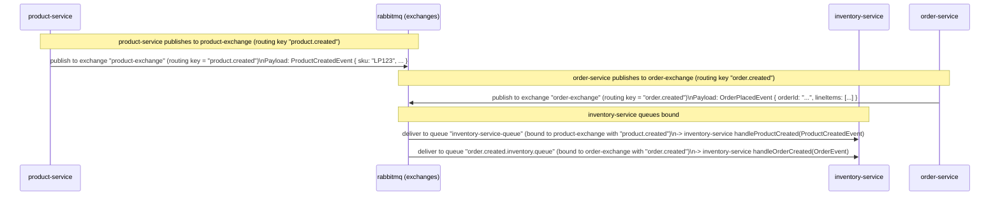
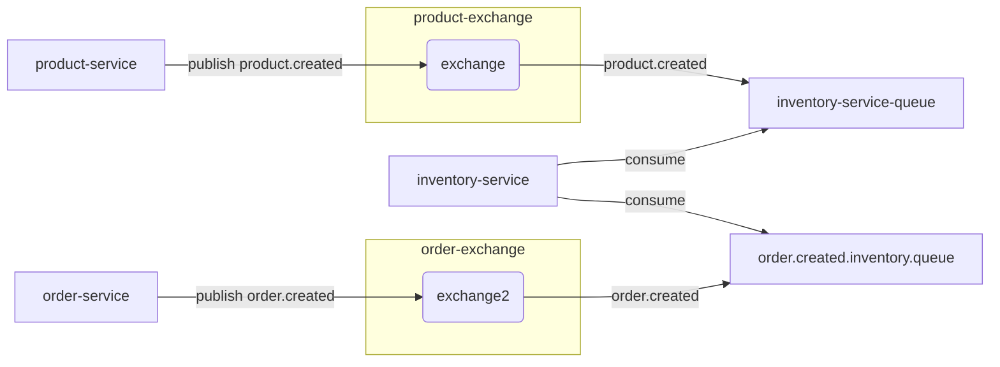

# Order lifecycle & message flow

This document describes the event shapes, routing keys and lifecycle transitions for orders.

## High level flow

- Client POSTs an order to `order-service`.
- `order-service` persists the order (status = CREATED) and publishes `order.created` (OrderPlacedEvent) containing line items with `productId` and `quantity`.
- `inventory-service` consumes `order.created`, attempts to reserve/commit stock and publishes one of:
  - `order.inventory.reserved` (InventoryReservedEvent) — all items reserved/committed
  - `order.inventory.partially_reserved` (InventoryPartiallyReservedEvent) — partial success
  - `order.inventory.reservation_failed` (InventoryReservationFailedEvent) — failure
- `order-service` consumes inventory outcome events and updates `Order.status` accordingly.

## OrderPlacedEvent (published by order-service)

Example JSON:

```json
{
  "orderNumber": "0f3b2e8a-...",
  "correlationId": "0f3b2e8a-...",
  "timestamp": "2025-10-26T13:00:00Z",
  "lineItems": [
    { "productId": 42, "quantity": 2 },
    { "productId": 7, "quantity": 1 }
  ]
}
```

Routing key: `order.created`
Exchange: `order-exchange`

Notes: `correlationId` is optional; currently set to `orderNumber` to simplify tracing.

## Inventory outcome events

- InventoryReservedEvent (routing key `order.inventory.reserved`)

Example:

```json
{
  "orderNumber": "0f3b2e8a-...",
  "correlationId": "0f3b2e8a-...",
  "timestamp": "2025-10-26T13:00:01Z",
  "lineItems": [ { "productId": 42, "quantity": 2 } ]
}
```

- InventoryReservationFailedEvent (routing key `order.inventory.reservation_failed`)

Example:

```json
{
  "orderNumber": "0f3b2e8a-...",
  "correlationId": "0f3b2e8a-...",
  "timestamp": "2025-10-26T13:00:01Z",
  "reason": "Insufficient stock",
  "attemptedItems": [ { "productId": 7, "quantity": 5 } ]
}
```

## Order status transitions

- CREATED -> RESERVED (when inventory reserves all items)
- CREATED -> RESERVATION_FAILED (when inventory fails to reserve any required items)
- CREATED -> PARTIALLY_RESERVED (when some but not all items reserved)
- PARTIALLY_RESERVED -> RESERVED or RESERVATION_FAILED
- RESERVED -> SHIPPED -> COMPLETED

Allowed transitions are enforced in `order-service` for idempotency and safety.

## Rollout notes

- Because we changed the `order.created` event shape (added lineItems/productId), deploy `inventory-service` changes before `order-service` in production.
- For a safe migration, make inventory listener tolerant of the old and new shapes for a short compatibility window.
# RabbitMQ Message Flow — microservices-project

This file contains a Mermaid diagram for the RabbitMQ message flow between services, plus a short mapping and payload notes.

## Sequence diagram



## Topology (graph)



## Component mapping (exact names from code)

- product-service
  - Exchange: `product-exchange`
  - Routing key: `product.created`
  - Producer: `ProductService.createProduct(...)` calls `rabbitTemplate.convertAndSend("product-exchange", "product.created", savedProduct.getSku())`

- order-service
  - Exchange: `order-exchange`
  - Routing key: `order.created`
  - Producer: `OrderService.createOrder(...)` calls `rabbitTemplate.convertAndSend("order-exchange", "order.created", event)`

- inventory-service
  - Listens for product-created
    - Queue: `inventory-service-queue` bound to `product-exchange` with `product.created`
    - Consumer: `ProductEventListener.handleProductCreatedEvent(ProductCreatedEvent)`
  - Listens for order-created
    - Queue: `order.created.inventory.queue` bound to `order-exchange` with `order.created`
    - Consumer: `OrderEventListener.handleOrderCreatedEvent(OrderEvent)`

## Payload compatibility notes

- product-service publishes the SKU (string) in the current `ProductService` implementation, while the inventory consumer expects a `ProductCreatedEvent` DTO. Verify that a JSON message converter is used and that producers produce compatible JSON shapes (or adjust producers/consumers).

- order-service publishes an `OrderPlacedEvent`; inventory expects an `OrderEvent` (shapes appear compatible but confirm fields and converter usage).

## How to view

- Open this file in VS Code and use a Mermaid preview extension (or paste the Mermaid blocks into https://mermaid.live/) to render diagrams.

## Next steps

- If you want I can:
  - (A) Confirm DTO class fields (`ProductCreatedEvent`, `OrderPlacedEvent`, `OrderEvent`) for exact compatibility.
  - (B) Add a small README excerpt showing how to run the docker-compose stack so the RabbitMQ topology appears.
  - (C) Export the diagram to PNG/SVG (requires local Mermaid CLI or remote renderer).


---
Generated on 2025-10-25.
