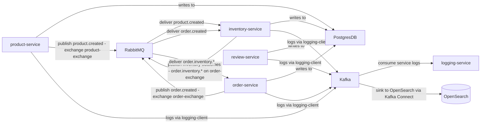
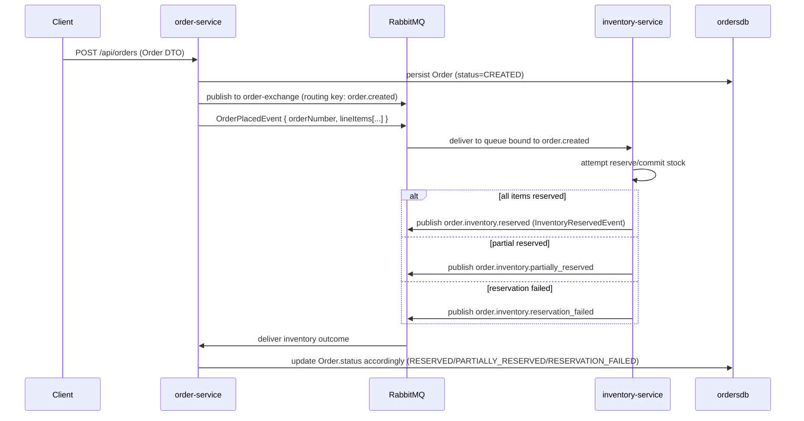

# Service Topology and Interaction Diagram

Generated: 2025-10-27

This document captures the structure of the microservices in this repository, their communication channels, exact RabbitMQ constants (from the code), message flows, runbook steps to start the system, and sample payloads for testing the key flows.

---

## Overview — services & infra

Services (ports shown are the ones exposed by `docker-compose.yml`):

- product-service (8080)
  - Database: `productsdb` (Postgres)
  - REST: `/api/products`
  - Publishes: `product-exchange` (routing key `product.created`)
- order-service (8081)
  - Database: `ordersdb` (Postgres)
  - REST: `/api/orders`
  - Publishes: `order-exchange` (routing key `order.created`)
  - Consumes: inventory outcome queues (reserved / reservation_failed)
- review-service (8082)
  - Database: `reviewsdb` (Postgres)
  - REST: `/api/reviews`
- inventory-service (8083)
  - Database: `inventorydb` (Postgres)
  - REST: `/api/inventory`
  - Consumes: `product-exchange` (`product.created`) and `order-exchange` (`order.created`)
  - Publishes: inventory outcome events on `order-exchange`
- logging-service (8090)
  - Consumes: logs from Kafka (structured JSON messages from the `logging-client` library)
  - No HTTP endpoints (console/collector)
- logging-client (library)
  - Used by services to publish structured logs to Kafka

Infrastructure (from `docker-compose.yml`):

- PostgreSQL (`postgres-service`) — port 5432; multiple DBs created: `productsdb`, `ordersdb`, `inventorydb`, `reviewsdb`
- RabbitMQ (`rabbitmq-service`) — AMQP 5672, management UI 15672
- Zookeeper (`zookeeper-service`) — 2181
- Kafka (`kafka-service`) — 9092
- OpenSearch (`opensearch`) — 9200 (local dev, security disabled)
- OpenSearch Dashboards (`opensearch-dashboards`) — 5601
- Kafka Connect (`kafka-connect`) — 8083 (mapped to host 8085)

---

## Exact RabbitMQ constants (from `inventory-service` code)

These constants are declared in `services/inventory-service/src/main/java/nik/kalomiris/inventory_service/config/RabbitMQConfig.java` and used by multiple services:

- PRODUCT_EXCHANGE_NAME = "product-exchange"
- PRODUCT_CREATED_QUEUE_NAME = "inventory-service-queue"
- ROUTING_KEY_PRODUCT_CREATED = "product.created"

- ORDER_EXCHANGE_NAME = "order-exchange"
- ORDER_CREATED_QUEUE_NAME = "order.created.inventory.queue"
- ROUTING_KEY_ORDER_CREATED = "order.created"
- ROUTING_KEY_ORDER_INVENTORY_RESERVED = "order.inventory.reserved"
- ROUTING_KEY_ORDER_INVENTORY_RESERVATION_FAILED = "order.inventory.reservation_failed"

(See file: `services/inventory-service/src/main/java/.../RabbitMQConfig.java`)

---

## High-level message topology (Mermaid flowchart)




Notes:
- Exchanges: `product-exchange` (product.created), `order-exchange` (order.created & inventory outcomes).
- Queues: `inventory-service-queue`, `order.created.inventory.queue`, plus order-side queues for inventory outcomes (see RabbitMQConfig and order-service listeners).
- Logging uses Kafka (topic name documented in README/STRUCTURED_LOGGING.md is used by `logging-client`).

---

## Order lifecycle sequence (Mermaid)



---

## Component mapping (concise)

- product-service
  - Exchange: `product-exchange`
  - Routing: `product.created`
  - DB: `productsdb`
  - REST: POST /api/products, GET /api/products
- order-service
  - Exchange: `order-exchange`
  - Routing: `order.created`
  - Consumes: outcome queues (`order.inventory.reserved`, `order.inventory.reservation_failed`)
  - DB: `ordersdb`
  - REST: POST /api/orders
- inventory-service
  - Exchanges bound: `product-exchange` (product.created) -> `inventory-service-queue`
                     `order-exchange` (order.created) -> `order.created.inventory.queue`
  - Publishes: `order.inventory.reserved`, `order.inventory.partially_reserved`, `order.inventory.reservation_failed` on `order-exchange`
  - DB: `inventorydb`
  - REST: /api/inventory
- review-service
  - DB: `reviewsdb`
  - REST: /api/reviews
- logging-service
  - Consumes Kafka topic for logs (see `logging-client` docs in `services/logging-client/STRUCTURED_LOGGING.md`)
  - No HTTP endpoints

---

## Short contract (inputs/outputs)

- OrderPlacedEvent (order-service -> order-exchange)
  - Payload: { orderNumber, correlationId, timestamp, lineItems: [{ productId/sku, quantity }] }
  - Routing key: `order.created`
- Inventory outcome events (inventory-service -> order-exchange)
  - InventoryReservedEvent: routing key `order.inventory.reserved`
  - InventoryPartiallyReservedEvent: routing key `order.inventory.partially_reserved`
  - InventoryReservationFailedEvent: routing key `order.inventory.reservation_failed`

Success criteria:
- Order service persists order and publishes `order.created` exactly once (or idempotently).
- Inventory service consumes `order.created`, attempts reservations, and publishes exactly one outcome event for the order (reserved/partial/failed).

---

## Edge cases and operational notes

- Message shape compatibility: docs note the `order.created` shape changed; inventory listeners are expected to be tolerant of both old and new shapes during rollout.
- Idempotency: RabbitMQ can redeliver; all consumers should handle duplicate events idempotently.
- Partial reservation: ensure handling in `order-service` is deterministic (PARTIALLY_RESERVED -> RESERVED or RESERVATION_FAILED transitions are allowed per docs).
- Logging pipeline: Kafka may be unavailable; `logging-client` should handle backpressure and fallbacks.
- Transactions: publishing after DB persistence is used; consider outbox pattern if you need stronger delivery guarantees.

---

## Runbook — start the stack and quick smoke tests

1) Start the stack (from repository root):

```bash
docker-compose up -d
```

2) Wait for containers to be healthy (Postgres, RabbitMQ, Kafka/Zookeeper).

3) Verify the services are up:

```bash
curl http://localhost:8080/actuator/health || true
curl http://localhost:8081/actuator/health || true
curl http://localhost:8083/actuator/health || true
```

4) Create a simple product (product-service):

```bash
curl -X POST -H "Content-Type: application/json" -d '{"name":"Laptop","description":"A laptop","price":1000.00,"sku":"LP123","categoryIds":[]}' http://localhost:8080/api/products
```

5) Create an order (order-service) to trigger the flow (example body):

```bash
curl -X POST -H "Content-Type: application/json" -d '{
  "orderLineItemsDtoList": [
    {"sku": "LP123", "price": 1000.00, "quantity": 1}
  ]
}' http://localhost:8081/api/orders
```

Expected flow: `order-service` persists the order, publishes `order.created` to `order-exchange`; `inventory-service` consumes it and publishes an outcome back to `order-exchange`; `order-service` consumes outcome and updates status.

---

## Sample event payloads

- OrderPlacedEvent (example):

```json
{
  "orderNumber": "0f3b2e8a-...",
  "correlationId": "0f3b2e8a-...",
  "timestamp": "2025-10-26T13:00:00Z",
  "lineItems": [ { "productId": 42, "quantity": 2 }, { "productId": 7, "quantity": 1 } ]
}
```

- InventoryReservationFailedEvent (example):

```json
{
  "orderNumber": "0f3b2e8a-...",
  "correlationId": "0f3b2e8a-...",
  "timestamp": "2025-10-26T13:00:01Z",
  "reason": "Insufficient stock",
  "attemptedItems": [ { "productId": 7, "quantity": 5 } ]
}
```

---

## Where to look in the code

- RabbitMQ topology (exchanges/queues/routing keys):
  - `services/inventory-service/src/main/java/nik/kalomiris/inventory_service/config/RabbitMQConfig.java`
  - Order listeners: `services/order-service/src/main/java/nik/kalomiris/order_service/listeners/InventoryEventListener.java`
  - Inventory listeners: `services/inventory-service/src/main/java/nik/kalomiris/inventory_service/listeners/OrderEventListener.java` and `ProductEventListener.java`

- Logging (producer library and structured logging docs):
  - `services/logging-client/STRUCTURED_LOGGING.md`
